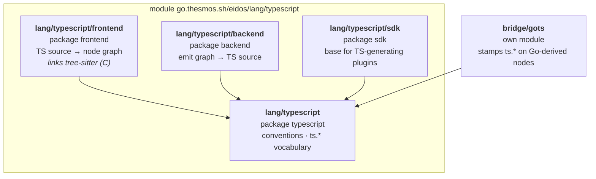
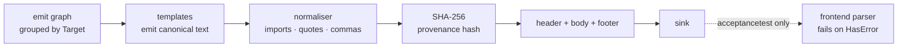

# TypeScript language support (`lang/typescript`)

> **Status: proposed.** No package under `lang/typescript` exists yet.
> This document describes the design; the contested part of it is
> [ADR-0008](../../adr/0008-map-typescript-interfaces-to-node-struct.md),
> which is Proposed rather than Accepted.

Everything eidos knows about TypeScript lives under `lang/typescript`,
in one module, following
[ADR-0007](../../adr/0007-group-language-support-by-language.md). Four
packages share the path and they are not interchangeable.

| Package | Owns | May be imported by |
|---|---|---|
| `lang/typescript` | TS *conventions* — no parsing, no rendering | Everyone |
| `lang/typescript/frontend` | Parsing TS into the node graph | The pipeline. **Not plugins.** |
| `lang/typescript/backend` | Rendering the emit graph into TS files | The pipeline. **Not plugins.** |
| `lang/typescript/sdk` | The base a TS-generating plugin embeds | Plugins that generate TS |

A bridge between two languages stays outside `lang/`, because it
belongs to a pair rather than to either one. `bridge/gots` is the
Go→TypeScript instance, alongside `bridge/protogo`.

## The C dependency

`lang/typescript/frontend` links tree-sitter's C runtime and the
TypeScript grammar. No other package in the module imports either.

Go applies build constraints per package, not per module, so the cost
is narrower than the `go.mod` suggests: `lang/typescript`,
`lang/typescript/backend` and `lang/typescript/sdk` all build under
`CGO_ENABLED=0` even though the module requires tree-sitter. Only the
frontend needs a C toolchain. The dependency is charged at
`go mod download`, not at build time for the packages that never reach
it.

Three modules make up the footprint: `go-tree-sitter`,
`tree-sitter-typescript`, and `mattn/go-pointer` indirect.

ADR-0007 records this class of cost as a consequence of one module per
language — "a language whose adapters have genuinely divergent
dependencies pays for all of them in one module". TypeScript is the
sharpest case, because the divergence is a toolchain rather than a Go
module.

## Declaration mapping

The frontend dispatches on the tree-sitter node kind, which is why
that is the left column.

| tree-sitter kind | → node kind | Notes |
|---|---|---|
| `interface_declaration` | `node.Struct` | See [ADR-0008](../../adr/0008-map-typescript-interfaces-to-node-struct.md) |
| `class_declaration` | `node.Struct` | `public_field_definition` → Field, `method_definition` → Method |
| `abstract_class_declaration` | `node.Struct` | + `ts.abstract` |
| `type_alias_declaration` | `node.Alias` | `IsAlias` always true; TypeScript has no defined-type form |
| `enum_declaration` | `node.Enum` | Covers `const enum`, which rides on `ts.constEnum` |
| `function_declaration` | `node.Function` | |
| `function_signature` | `node.Function` | Overload declaration without a body; see `ts.overloads` |
| `lexical_declaration` (`const`) | `node.Constant` | |
| `lexical_declaration` (`let`), `variable_declaration` | `node.Variable` | |
| `import_statement` | `node.Import` | `Path` is the module specifier verbatim |
| `ambient_declaration` | unwrapped | Inner declaration + `ts.ambient` |
| `export_statement` | unwrapped | Inner declaration + `ts.exported`, `ts.defaultExport` |
| `internal_module` | flattened | Namespace members hoisted, qualified via `ts.namespace` |

`class_heritage` carries `extends` and `implements` together. Both
become `node.Embed` entries, discriminated by `ts.heritage`.

## What rides on `ts.*` metadata

The node model has no variant for these shapes, so they ride on
metadata keys — the treatment `go.isChannel` and `go.constraintTerms`
already get on the Go side. `docs/lang/typescript/frontend.md` is the
catalogue; the summary is that unions, intersections, tuples,
optionality, readonly-ness, visibility, index signatures, decorators
and accessor kind all live on keys rather than on fields.

One key sets the limit deliberately. `ts.typeText` carries the
verbatim source text of a type expression with no structured form —
conditional types, mapped types, `keyof`, `infer`, template-literal
types. Modelling those structurally would mean reproducing most of
TypeScript's type system inside a language-agnostic package. Carrying
the text lets a backend round-trip the type and a plugin match on it,
while nothing claims to understand it.

## What the frontend cannot answer

tree-sitter produces a syntax tree for one file and resolves nothing
across files. The `ts.*` vocabulary is therefore structural where
`go.*` is semantic, and three questions have no TypeScript answer:

- **Type satisfaction.** `go.isStringer` and `go.isComparable` have no
  counterpart. Whether a type satisfies an interface is not
  determinable from syntax.
- **Cross-file type identity.** A type imported from `node_modules` is
  a name and a module specifier. Within the parsed set the frontend
  resolves specifier plus name to a declaration; outside it, it does
  not.
- **Inferred types.** `const x = compute()` carries no annotation, so
  `Constant.Type` is nil. `HasDeclaredType()` already models the
  absence, but a plugin assuming a type is always present will not
  survive it.

None of this obstructs code generation, which reads declarations
rather than inferring them. It does mean a plugin written against
`go.*` does not transfer to `ts.*` unexamined.

## Backend: canonical output without a formatter

`format.Source` does two jobs for the Go backend: it makes output
canonical, and it rejects output that is not valid Go, which the
backend reports as an Error diagnostic
(`lang/golang/backend/finalise.go`). No Go-native TypeScript formatter
exists, so the two jobs are answered separately.

Canonical form comes from templates that emit it directly, plus a
normaliser for what templates cannot express cleanly — the division of
labour `writeImportBlock` already uses on the Go side. Each choice has
one value, because byte-identical output admits no second one.

| Decision | Value |
|---|---|
| Quotes | Single |
| Semicolons | Always |
| Indent | Two spaces |
| Trailing commas | On multi-line lists |
| Import specifiers | Sorted; type-only imports separated |
| Line wrapping | None |

Line wrapping is absent by decision. Matching Prettier means
implementing its layout algorithm, which is a full printer and the
largest single component this adapter could acquire. Unwrapped output
is deterministic and cheap, and produces long lines for long
signatures — which a consumer's own Prettier run will rewrite anyway,
since a generated file's formatting is not a contract.

Validity cannot be checked in the backend. Parsing needs tree-sitter,
tree-sitter lives in the frontend, and depguard forbids a backend
importing a frontend — correctly, since the alternative is a backend
that carries a C toolchain. The check therefore lives in the
`acceptancetest` rung, which parses every generated file and fails on
`HasError()`. This mirrors the Go side, where `acceptancetest` is the
only gate that runs `go build` over generated output.

The consequence is real and asymmetric: on the Go side a broken
template fails every run, and here it fails only under test.

## `bridge/gots`

An annotator stamping `ts.*` translation meta on Go-derived nodes, so
`lang/typescript/backend` renders valid TypeScript without learning
anything Go-specific. The shape follows `bridge/protogo`.

| Go | TypeScript |
|---|---|
| `string` | `string` |
| `bool` | `boolean` |
| `int`, `int8`…`int32`, `float32`, `float64` | `number` |
| `int64`, `uint64` | `bigint` |
| `[]byte` | `Uint8Array` |
| `[]T` | `T[]` |
| `map[K]V` | `Record<K, V>` for string-like K, else `Map<K, V>` |
| `*T` | `T` with `ts.optional` |
| `time.Time` | `string`, ISO 8601 |
| `error` | `Error` |
| `context.Context` | dropped from the signature |
| `chan T` | unrepresentable — Error diagnostic |

Member names convert Go PascalCase to TypeScript camelCase. A
pre-stamped `ts.name` wins, so a hand-written override survives, on
the same terms `protogo` gives `go.name`.

The `int64` row is a trade with no clean side. `bigint` is the only
type that holds the full range, but `JSON.parse` yields `number`, so a
generated `bigint` is wrong for any value crossing JSON without a
reviver. `number` matches what consumers expect and loses precision
silently above 2^53. The mapping above chooses correctness at the type
level and leaves the JSON boundary to the consumer.
